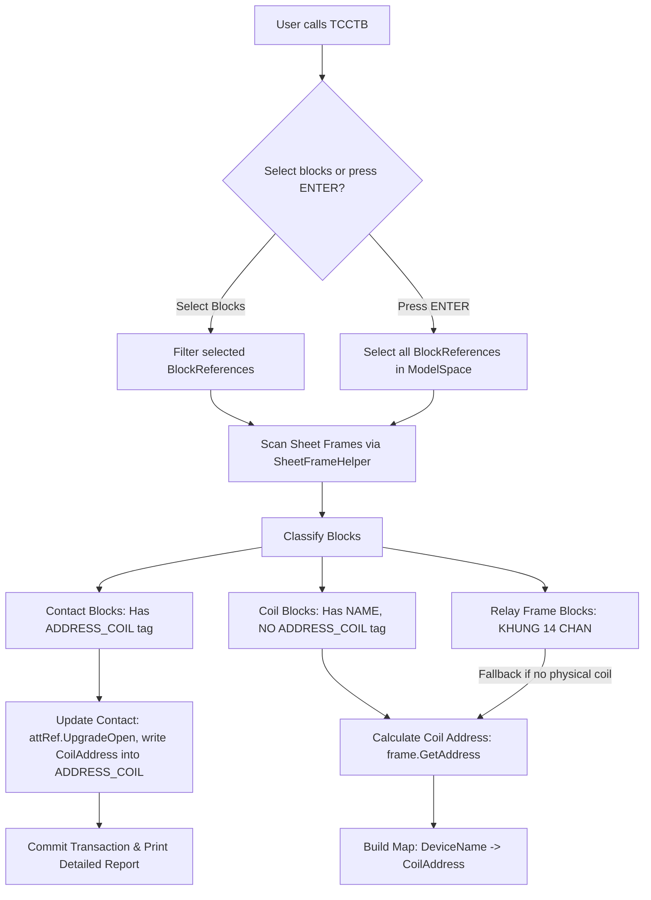
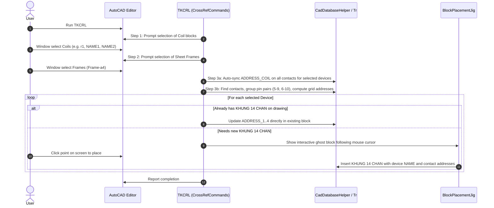

# AGENTS.md - Developer & Agent Guide for CadElectricalToolkit

> **Target Audience:** AI Coding Agents (Antigravity, Claude, Copilot, etc.) and Human Engineers working on this codebase.  
> **Repository Root:** `f:/1.Project/1.C_shard/C_AutoCad/`  
> **Primary Technology:** C# .NET Framework 4.8, AutoCAD .NET Managed API (2021+), WinForms.

---

## 1. Project Overview & Mission

**CadElectricalToolkit** is a high-performance AutoCAD add-in plugin that brings AutoCAD Electrical-style automation into standard vanilla AutoCAD (2021, 2022, 2023, 2024, 2025+).

Industrial electrical designers often use standard AutoCAD for panel drafting and mechanical layouts because AutoCAD Electrical is heavy and rigid. This plugin enables them to work in standard AutoCAD while automating:
1. **Cross-referencing (Tham chiếu chéo rơ-le / contactor):**
   - Automatically link contact blocks (`NO auxiliary contact`, `NC auxiliary contact`) with coil blocks (`COIL_CONTACTOR`, `RL_COIL`).
   - Calculate exact grid coordinates (`SheetNo-RowCol`, e.g., `01-4A`, `02-5B`).
   - Populate cross-reference tables (block `KHUNG 14 CHAN` for Omron MY4N, IDEC RU4S, Schneider relays).
   - Write coil addresses to contact attributes (`ADDRESS_COIL`) in bulk.
2. **Title Block & Sheet Management (Quản lý khung tên & số trang):**
   - Auto-number sheets with prefix/suffix/formatting, e.g. `Page/Total` (`12/24`) via interactive UI (`DSTTKBT`).
   - Sheet indexing table (`TKDMBV`).
3. **Wire Numbering & Ferrule Tags (Đánh số dây & gen số):**
   - Sequential wire tagging (`INSGEN`), ferrule list export (`TKGEN`), sheet-based sync (`SYNGEN`).
4. **Terminal Strips (Cầu đấu dây):**
   - Terminal report (`TKCD`) and terminal re-numbering (`SYNCD`).
5. **PLC I/O Addressing:**
   - Digital Input/Output address assignment (`TKPLCIN`, `TKPLCOUT`, `SYNPLC`).
6. **BOM & Data Export:**
   - Bill of Materials (`TKDMTB`) and CAD-to-Excel export (`CAD2EXCEL`).
7. **Drafting Acceleration:**
   - Quick dimension summation (`CDN`), fast sequential text numbering (`DSTT`), text alignment (`GTD`, `GTN`).
8. **Link Tracing & Navigation (Truy vết liên kết trang):**
   - Click on Arrow-To/From block or Relay contact/coil to find destination page and draw visual guide line directly to the target `Frame-a4` title block (`TIMTRANG`, `TRACE`, `XOALINK`).

---

## 2. Architecture & Directory Layout

```text
C_AutoCad/
├── AGENTS.md                                # This agent onboarding & architecture reference
├── README.md                                # General project documentation
├── CadElectricalToolkit.slnx                 # Solution file
├── bin/Release/CadElectricalToolkit.dll      # Standalone release output
├── bundle/
│   └── CadElectricalToolkit.bundle/         # Autodesk Autoloader structure
│       ├── PackageContents.xml              # Autoloader manifest
│       └── Contents/net48/                  # Target output for AutoCAD auto-load
│           └── CadElectricalToolkit.dll
├── docs/                                    # Extended documentation
│   ├── ARCHITECTURE_AND_WORKFLOW.md
│   └── .docs/
│       ├── PROJECT_ANALYSIS_AND_ROADMAP.md
│       ├── README.md
│       └── TEST_GUIDE_AND_BLOCK_SPEC.md
└── src/
    └── CadElectricalToolkit/
        ├── CadElectricalToolkit.csproj      # .NET Framework 4.8 target
        ├── AppEntryPoint.cs                 # IExtensionApplication (Initialize / Terminate)
        ├── Core/
        │   └── ElectricalConfig.cs          # Centralized configuration (Tags, Grid, Margins)
        ├── CadAccess/                       # AutoCAD API wrappers & database access
        │   ├── CadDatabaseHelper.cs         # Document locking & Transaction runner
        │   ├── AttributeHelper.cs           # Safe Block & Attribute reading/writing
        │   ├── SelectionHelper.cs           # Entity scanning & selection filters
        │   ├── SheetFrameHelper.cs          # Sheet title frame bounding box & grid resolution
        │   ├── BlockPlacementJig.cs         # Interactive mouse Jig for placing blocks one by one
        │   ├── BlockDefinitionHelper.cs     # Sample blocks creation (TAOBLOCKMAU)
        │   └── TableHelper.cs               # AutoCAD Native Table generator
        ├── Commands/                        # AutoCAD [CommandMethod] Entry Points
        │   ├── CrossRefCommands.cs          # TCCTB, TKCRL, SYNCRL, KTCRL, DSTTKBT
        │   ├── TraceCommands.cs             # TIMTRANG, TRACELINK, TRACE, XOALINK (Vẽ line chỉ dẫn truy vết trang)
        │   ├── WireNumberCommands.cs        # INSGEN, TKGEN, SYNGEN
        │   ├── TerminalCommands.cs          # TKCD, SYNCD
        │   ├── PlcCommands.cs               # TKPLCIN, TKPLCOUT, SYNPLC
        │   ├── SheetCommands.cs             # TKDMBV, SYNREV, SYNTF, GBV, TBV
        │   ├── BomCommands.cs               # TKDMTB, CAD2EXCEL
        │   ├── DraftingCommands.cs          # CDN, DSTT, GTD, GTN
        │   └── AboutCommands.cs             # ELECINFO, TT, TAOBLOCKMAU, SAMPLEBLOCKS
        └── UI/
            ├── CadWindowHelper.cs           # WPF Window modal dialog & AutoCAD handle integration
            └── Views/                       # Modern WPF Windows (XAML & Code-behind)
                ├── ToolInfoWindow.xaml      # Commands cheatsheet & quick run UI (WPF)
                └── AutoNumberingWindow.xaml # Auto numbering dialog for Frames & Block attributes (WPF)
```

---

## 3. Critical AutoCAD .NET Gotchas & Coding Rules

When modifying or adding C# code in this codebase, **YOU MUST ADHERE TO THESE RULES**:

### Rule 1: NEVER call `tr.GetObject(id, OpenMode.ForWrite)` if `id` was already opened `ForRead`
- **Gotcha:** If an entity or attribute was opened with `OpenMode.ForRead` earlier in the same transaction, calling `tr.GetObject(id, OpenMode.ForWrite)` throws `Autodesk.AutoCAD.Runtime.Exception: eWasOpenForRead`. This aborts the transaction immediately.
- **Pattern:** Always open with `OpenMode.ForRead`. When modification is needed, check:
  ```csharp
  if (!entity.IsWriteEnabled)
  {
      entity.UpgradeOpen();
  }
  entity.TextString = newValue;
  ```
- **Helper methods in [`AttributeHelper.cs`](file:///f:/1.Project/1.C_shard/C_AutoCad/src/CadElectricalToolkit/CadAccess/AttributeHelper.cs):**
  Use `blkRef.SetAttributeValue(tr, newValue, candidateTags)` and `blkRef.GetAttributeValue(tr, candidateTags)`. These methods already implement safe `UpgradeOpen()`.

### Rule 2: Geometric Extents Can Throw `eInvalidExtents`
- Dynamic blocks, blocks containing empty text, or uninitialized blocks can throw when calling `blkRef.GeometricExtents`.
- **Pattern:** Always use [`SheetFrameHelper.TryGetExtents(blkRef, out Extents3d ext)`](file:///f:/1.Project/1.C_shard/C_AutoCad/src/CadElectricalToolkit/CadAccess/SheetFrameHelper.cs), which tries `GeometricExtents` and falls back to `blkRef.Bounds`.

### Rule 3: Single-Sheet Drawings & Border Tolerances
- Users frequently draw on a single A4/A3 sheet (e.g. sheet `01`).
- If an entity is near the border, strict containment `point >= MinPoint && point <= MaxPoint` might fail.
- `SheetFrameHelper.FindFrameContaining(frames, point)` applies a `15.0` unit tolerance, and if only 1 frame exists on the drawing, it automatically resolves to that frame. If multiple exist, it falls back to the frame with the closest centroid.

### Rule 4: Coordinate Grid & Title Block Offsets
- In electrical drawings (e.g. `Frame-a4`), the drawing grid rows 1 to 6 are situated strictly **ABOVE the title block** (company name, drawing numbers, revisions).
- The title block occupies ~14% of the total frame height at the bottom.
- `ElectricalConfig.FrameBottomMarginRatio = 0.14` and `FrameTopMarginRatio = 0.025` are subtracted from the frame height before dividing into the 6 rows. **Never divide the raw bounding box height by 6 without subtracting margins**, or all rows will be offset by -1.

### Rule 5: User Prompts vs Database Transactions
- Never invoke blocking editor selection prompts (`ed.GetSelection()`, `ed.GetPoint()`) inside an active database `Transaction` or `LockDocument` scope.
- Always get user selections / inputs **first**, then run `CadDatabaseHelper.RunTransaction((tr, db) => { ... })`.

---

## 4. Central Configuration (`ElectricalConfig.cs`)

All user-customizable tag names, block names, and grid parameters are consolidated in [`src/CadElectricalToolkit/Core/ElectricalConfig.cs`](file:///f:/1.Project/1.C_shard/C_AutoCad/src/CadElectricalToolkit/Core/ElectricalConfig.cs):

| Category | Property | Default Value | Meaning |
| :--- | :--- | :--- | :--- |
| **Relay / Contactor** | `TagDeviceName` | `"NAME"` | Device tag (e.g. `r1`, `KM1`, `KA1`) |
| | `TagPin1`, `TagPin2` | `"TERM01"`, `"TERM02"` | Contact terminal numbers (e.g. `5`, `9` or `6`, `10`) |
| | `TagAddressCrossRef` | `"ADDRESS_COIL"` | Cross-ref tag on auxiliary contacts showing coil position |
| | `TagAddressContactAliases` | `["ADDRESS_COIL", "ADDRESS_C", "ADDRESS", ...]` | Aliases for contact cross-ref tag |
| | `BlockRelayFrame` | `"KHUNG 14 CHAN"` | Name of the 14-pin relay summary table block |
| | `TagRelayFrameAddresses` | `["ADDRESS_1", "ADDRESS_2", "ADDRESS_3", "ADDRESS_4"]` | Rows in table corresponding to contact pairs |
| | `PinPairToAddressIndex` | Map: `5-9` $\rightarrow 0$, `6-10` $\rightarrow 1$, `1-9` $\rightarrow 0$, etc. | Maps NO and NC terminal pairs to rows 1..4 |
| **Frame & Grid** | `BlockTitle` | `"Frame-a4"` | Default title block frame name |
| | `TagSheetNumber` | `"A00"` | Tag for sheet number |
| | `TagTotalSheets` | `"TSHEET"` | Tag for total sheets (e.g. `24` in `12/24`) |
| | `FrameColumns` | `8` | Total grid columns (`A`, `B`, `C`, `D`, `E`, `F`, `G`, `H`) |
| | `FrameRows` | `6` | Total grid rows (`1`, `2`, `3`, `4`, `5`, `6`) |
| | `FrameBottomMarginRatio`| `0.14` (14%) | Title block height ratio at bottom |
| | `FrameTopMarginRatio` | `0.025` (2.5%) | Top border margin ratio |
| | `FrameLeftMarginRatio` | `0.035` (3.5%) | Left border (binding) margin ratio |
| | `FrameRightMarginRatio`| `0.02` (2.0%) | Right border margin ratio |

---

## 5. Core Processing Pipelines & Workflows

### 5.1. Bulk Coil Address Sync (`TCCTB` & `SyncCoilAddressesToContacts`)



### 5.2. 14-Pin Relay Summary & Interactive Placement (`TKCRL`)



### 5.3. Two-Way Relay Synchronization (`SYNCRL`)
- **Direction 1 (Coil $\rightarrow$ Contacts):** Resolves coil position $\rightarrow$ Writes to `ADDRESS_COIL` on contacts.
- **Direction 2 (Contacts $\rightarrow$ Relay Frame):** Resolves each contact's grid position $\rightarrow$ Writes to `ADDRESS_1..4` on `KHUNG 14 CHAN`.

### 5.4. Sheet & Block Attribute Numbering with WPF UI (`DSTTKBT` & `DSTT`)
- Opens WPF [`AutoNumberingWindow`](file:///f:/1.Project/1.C_shard/C_AutoCad/src/CadElectricalToolkit/UI/Views/AutoNumberingWindow.xaml).
- **Tab 1: STT khung tên:** Sets start number, prefix, suffix, style (1, 01, A, 001), sorting direction, and page mode (`Current/Total`, e.g., `01 /24`).
- **Tab 2: STT block attribute:** Sets prefix (e.g. `DI.`), suffix, start number, step, target block name (e.g. `ten_chan_domino`), attribute TAG (e.g. `TEN_CHAN`), interactive CAD tag picker (`Chọn TAG`), and batch numbering or click-by-click numbering directly on CAD.

---

## 6. Build & Packaging Instructions

### Build via Command Line
```powershell
# Build Debug (default)
dotnet build src/CadElectricalToolkit/CadElectricalToolkit.csproj

# Build Release
dotnet build src/CadElectricalToolkit/CadElectricalToolkit.csproj -c Release
```

### Post-Build Auto-Copy
The project file contains a post-build target `<Target Name="CopyToBundle" AfterTargets="Build">` that automatically copies the compiled DLL to:
`bundle/CadElectricalToolkit.bundle/Contents/net48/CadElectricalToolkit.dll`

### Manual Loading into AutoCAD
1. Open AutoCAD 2021+
2. Type command: `NETLOAD`
3. Browse to:
   - `f:\1.Project\1.C_shard\C_AutoCad\bundle\CadElectricalToolkit.bundle\Contents\net48\CadElectricalToolkit.dll` (or `bin\Release\CadElectricalToolkit.dll`)
4. Verify by running `ELECINFO` or `TT`.
